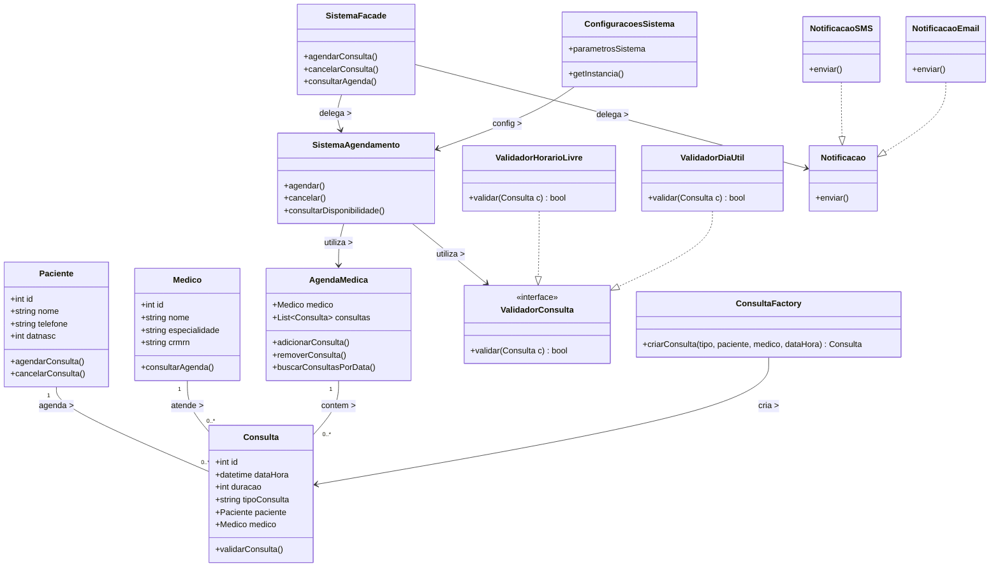

🔧 Projeto 1: Sistema de Agendamento de Consultas Médicas
[Repository Link](https://github.com/Gustavo-DSC/poo2projeto.git)

/*************  ✨ Smart Paste 📚  *************/
/*******  75646f17-9215-4be1-a62a-b5327632d298  *******/
Descrição: Permite que pacientes agendem consultas, médicos visualizem horários disponíveis e a recepção gerencie os atendimentos.

📐 Padrões e Princípios Aplicados:
Single Responsibility: Paciente, Consulta, Médico têm responsabilidades únicas.

Open-Closed: Novos tipos de consulta (presencial, online) são adicionados sem modificar classes existentes.

GRASP Expert: Consulta calcula duração e validade, pois tem os dados.

GRASP Creator: AgendaMedica cria Consulta por agregá-la.

GRASP Controller: SistemaAgendamento coordena ações do usuário.

Baixo acoplamento / Alta coesão: Separação de camadas (UI, domínio, dados).

SOLID:

SRP: ServicoAgendamento, ServicoNotificacao são separados.

OCP: ValidadorConsulta com subclasses para diferentes regras.

DIP: Interfaces para repositórios e notificadores.

Strategy: Validação de regras de agendamento com múltiplas estratégias (ValidadorHorarioLivre, ValidadorDiasUteis, etc.).

Facade: SistemaFacade orquestra uso de subsistemas (PacienteService, ConsultaService, etc.).

Adapter: Integração com API externa de envio de SMS.

Singleton: ConfiguracoesSistema.

Factory / Factory Method: Criação de objetos ConsultaFactory.

Decorator: Adiciona lembretes por e-mail, WhatsApp, etc., à Notificacao.

Composite: CalendarioMensal composto de DiaAgenda.

Visitor: Relatórios médicos visitam Consulta, Paciente para gerar estatísticas.

# Diagrama de Classes - Sistema de Agendamento de Consultas Médicas

